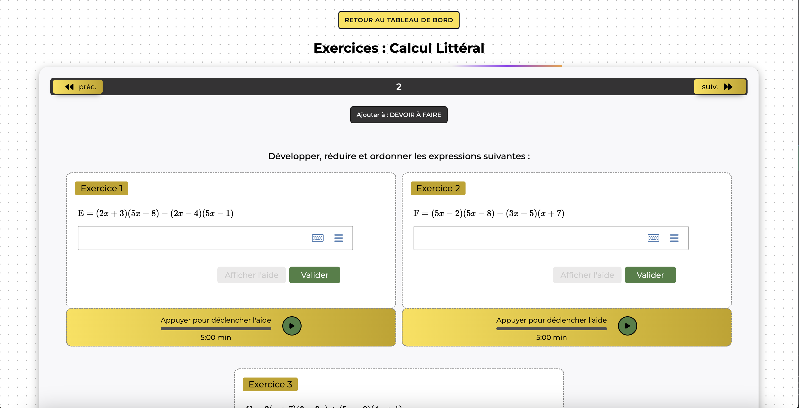

# Math-max

Math-max est une application "réactive" d'exercices de mathématiques de la sixième à la terminale, offrant des suggestions de réponses et des réponses intégrales.
On peut aussi programmer et enregistrer des " devoirs à faire plus tard " avec un tableau de bord intuitif et simple à utiliser. Après chaque validation d'un devoir on reçoit la note finale.

## Table des matières

- [L'application](#l'application)
- [Prérequis](#prérequis)
- [Installation](#installation)
- [Lancer le projet](#lancer-le-projet)
- [Structure du projet](#structure-du-projet)

## L'application

### L'accueil


### Tableau de bord


### Exemple d'exercice



## Prérequis

Avant de commencer, assurez-vous d'avoir installé les éléments suivants sur votre machine :

- [Node.js](https://nodejs.org/) (version 20.6.0 ou supérieure)
- [npm](https://www.npmjs.com/)

## Installation

1. Clonez le repository sur votre machine locale en utilisant git :

```bash
git clone https://github.com/BoubaWade/math-max.git
cd math-max
```

2. Installez les dépendances du projet avec npm :

```bash
npm install
```

## Lancer le projet

Pour lancer le projet en mode développement, utilisez le script suivant :

```bash
npm run dev
```

## Structure du projet

```bash
math-max/
├── public/
│   └── images
├── src/
│   ├── app/
│   ├── assets/
│   ├── components/
│   ├── css/
│   ├── features/
│   ├── hooks/
│   ├── pages/
│   ├── stripe/
│   ├── supabase/
│   ├── Types/
│   ├── utils/
│   ├── App.tsx
│   └── main.tsx
├── .gitignore
├── index.html
├── package.json
├── README.md
├── tsconfig.json
└── vite.config.ts
```
